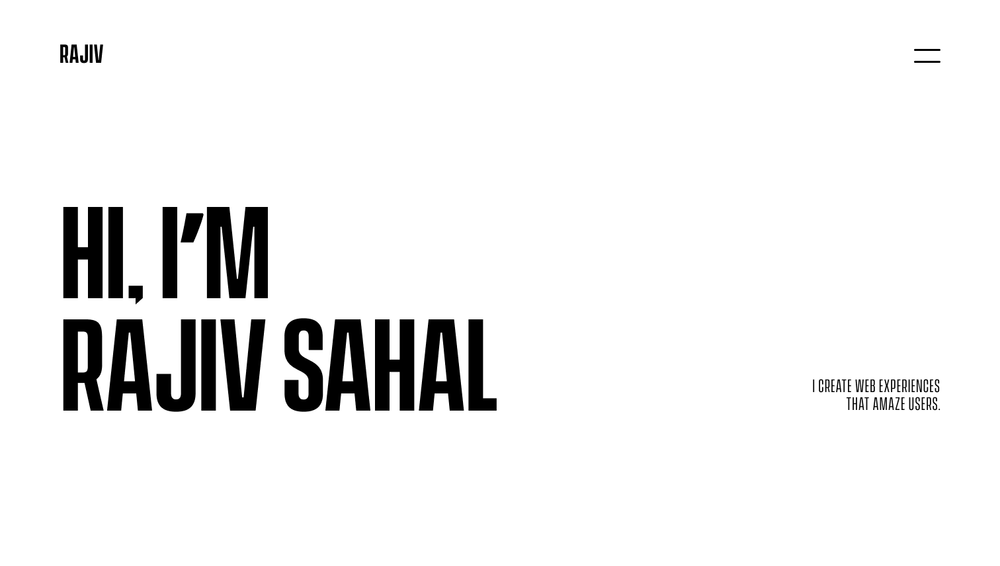

# Rajiv Sahal

A front-end developer who designs sleek interfaces and builds interactive websites that&nbsp; &nbsp; people. Some days I break my code, while on some days my code breaks me. My current interests include learning ReactJs and exploring open source projects.

## The things I love :

 &nbsp; &nbsp;  &nbsp; &nbsp; 

## The things I hate :

 &nbsp; &nbsp;  &nbsp; &nbsp; 

## The things that make my life easier :

 &nbsp; &nbsp; &nbsp;  &nbsp;  &nbsp;  &nbsp;
 &nbsp; &nbsp; &nbsp;

 

## &nbsp; Activity Graph :

## &nbsp; Github Profile Summary Card :

##  Get in touch:

 &nbsp;  &nbsp;  &nbsp;  &nbsp; 
